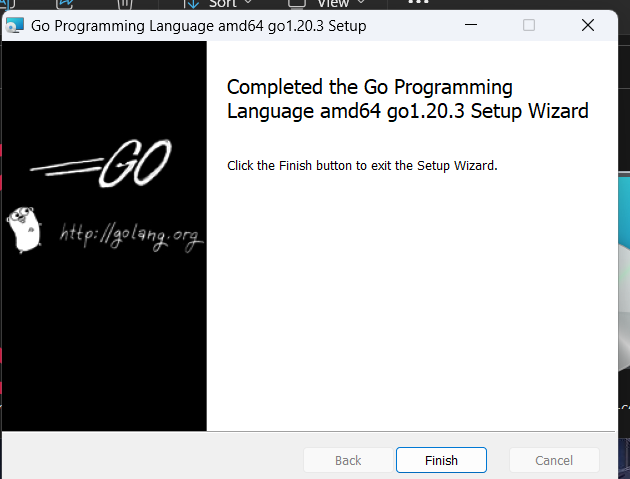
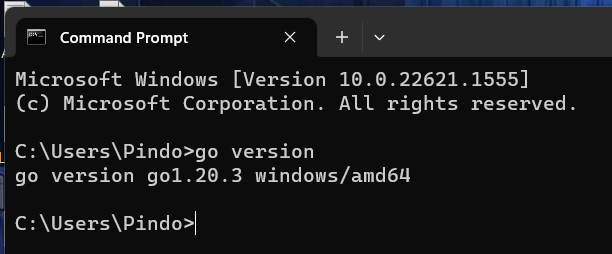
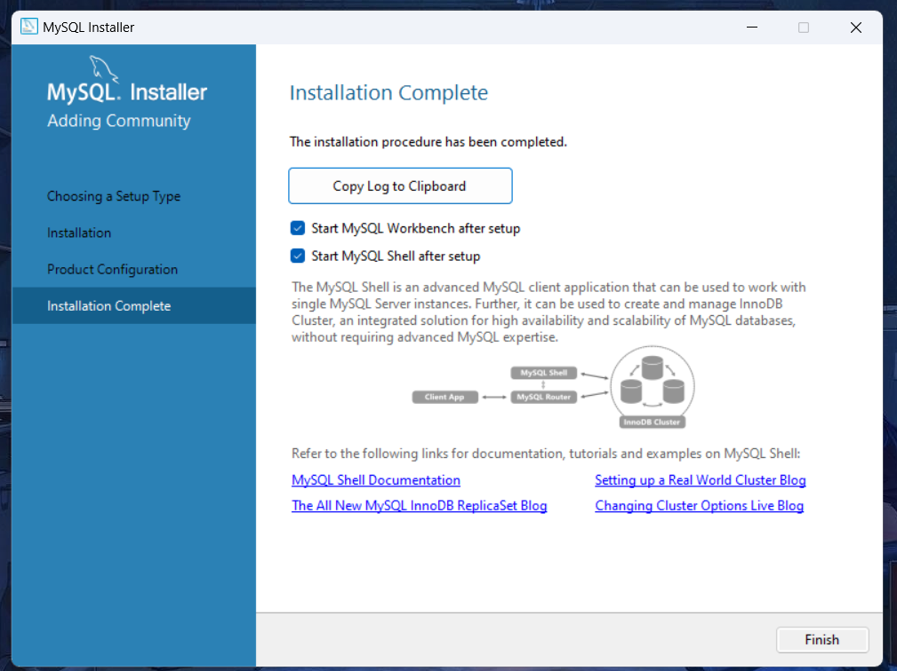
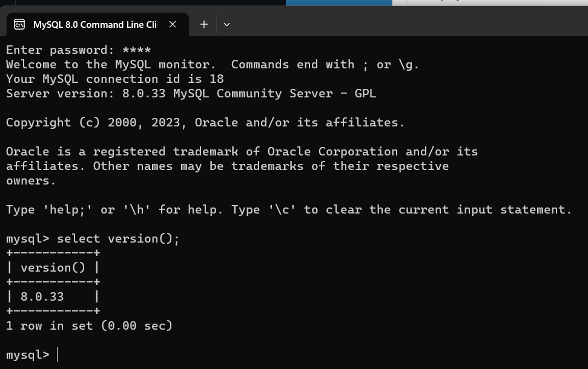
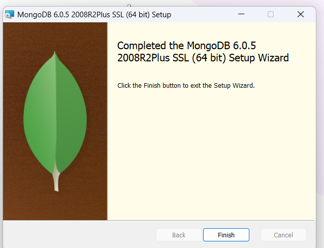
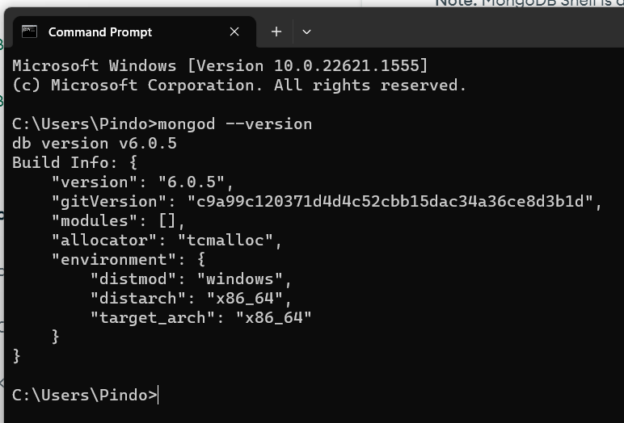

# Install Go, MySQL dan MongoDB

## Install Go

1. Download GO Installer melalui [Golang](https://golang.org/doc/install)

2. Install GO dan Cek versinya.

 

## Install MySQL

1. Download MySQL Installer melalui [MySQL](https://dev.mysql.com/downloads/installer/)

2. Install MySQL dan Cek versinya.

 

 

## Install MongoDB

1. Download MongoDB Installer melalui [MongoDB](https://www.mongodb.com/try/download/community?tck=docs_server)

2. Install MongoDB dan Cek versinya.

 

