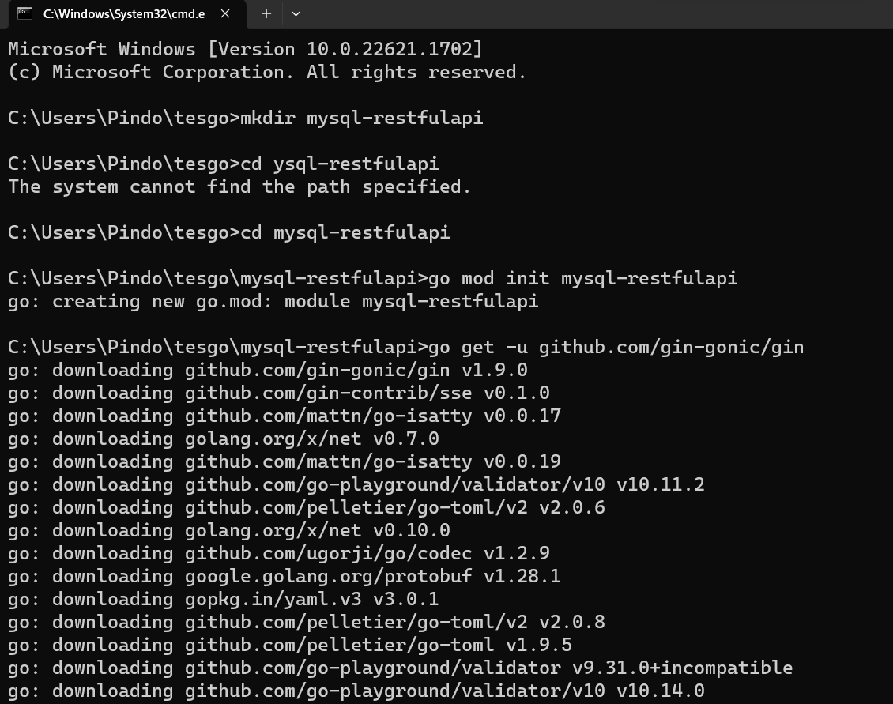
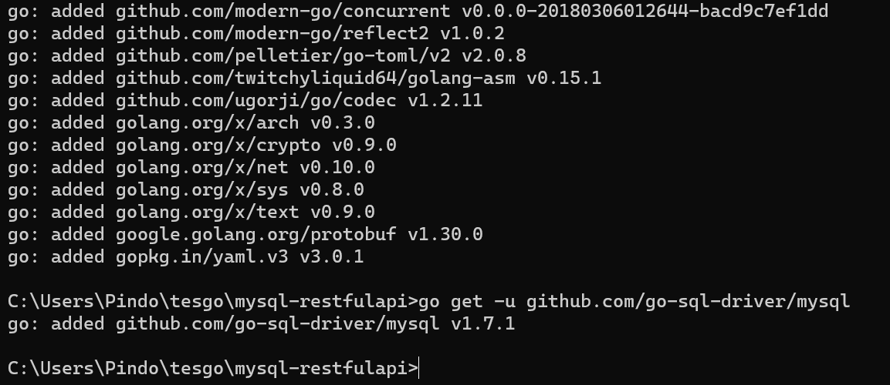
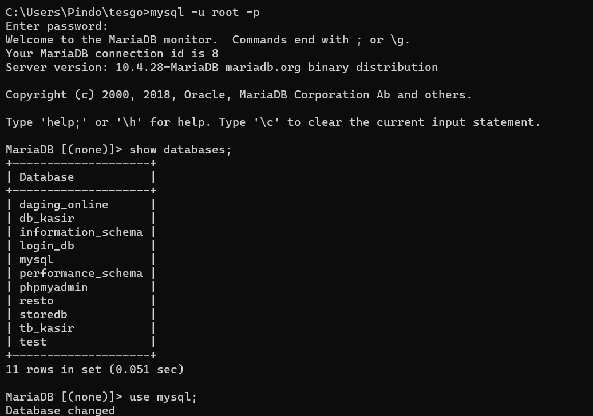
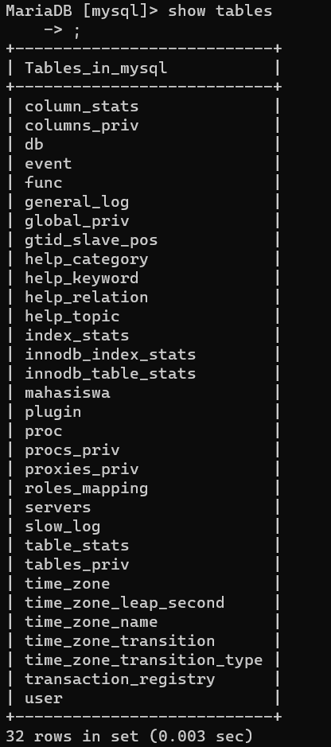
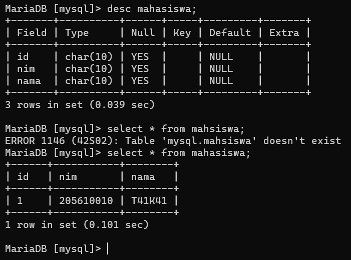
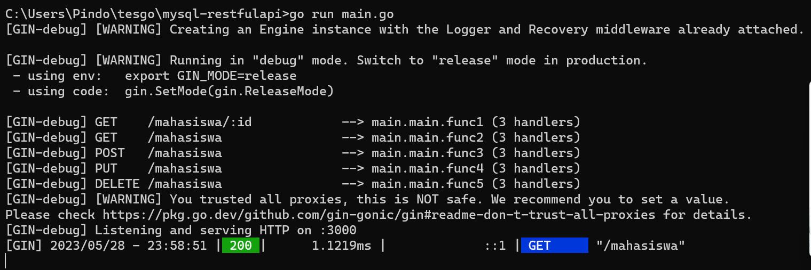
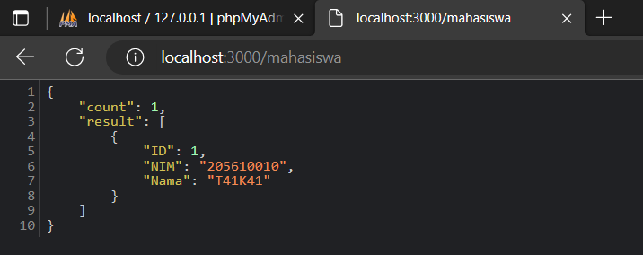

# Gin RESTful API membaca data dari MySQL dan MongoDB

## MySQL
1. Create direktori baru, kemudian instal module dan driver yang diperlukan.

 

 

2. Create database MySQL lalu masukan data kedalamnya.

3. Buat file program **main.go** untuk membaca data pada database yang telah dibuat.  
Kode program RESTful API untuk membaca data dari MySQL adalah sebagai [berikut](kode/mysql-restfulapi/main.go) 

4. Jalankan program yang telah dibuat.

 

5. Selagi program berjalan, akses RESTful API melalui **web browser** 

## MongoDB
1. Create database baru pada MongoDB.

 

2. Create direktori baru, kemudian instal module dan driver yang diperlukan.

 

 

3. Buat file program untuk membaca data pada database yang telah dibuat.  
Kode program RESTful API untuk membaca data dari MongoDB adalah sebagai [berikut](#) 
