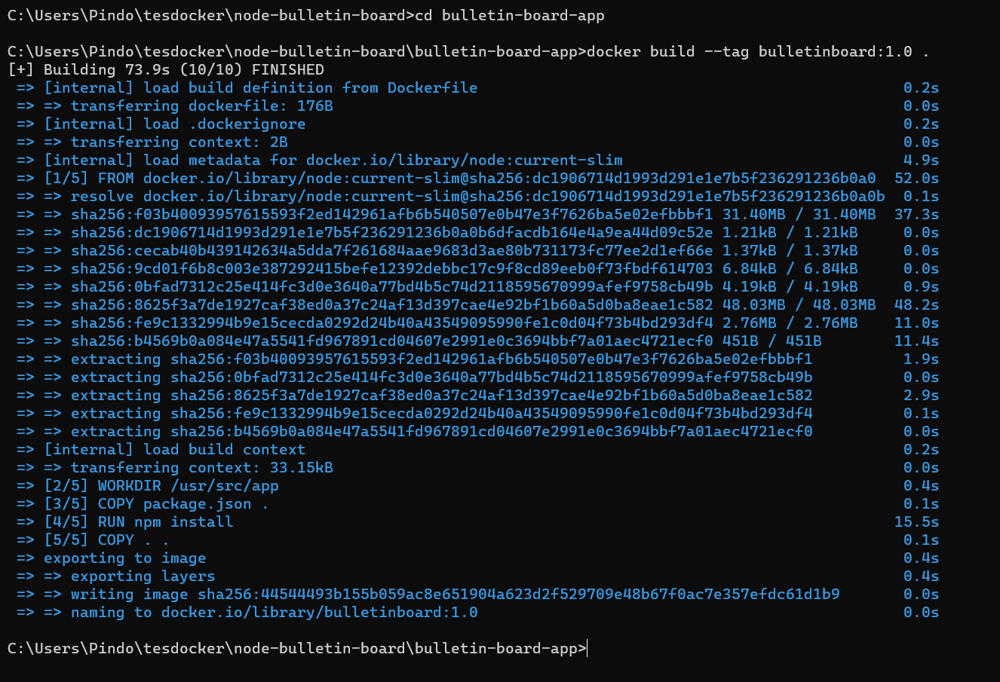

# Get Started - Docker

### a. Cek Versi dan Hello World pada Docker. 

### b. Cek Image atau Container yang berada di Docker. 

### c. Test Sample Docker 

1. Buat direktori baru dan clone sample docker. [Contoh](https://github.com/dockersamples/node-bulletin-board)

 

 

2. Masuk kedalam direktori sample dan build. 

 

3. Setelah berhasil build, publish sample docker agar dapat diakses. Klik **Allow access** untuk mengizinkan. 

 

4. Akses sample docker melalui web browser. 

 

5. Melihat dan menghapus image atau container yang berada di Docker. 

 

 

### d. Push Sample pada Docker Lokal ke Docker Hub. 

1. Lakukan login ke [Docker Hub](https://hub.docker.com/) dan create repository baru. 

 

2. Lakukan login pada Docker lokal dengan akun Docker Hub, kemudian buat tag pada sample dan push sample ke Docker Hub. 

 

3. Cek ke Docker Hub dan pastikan sudah muncul sample dengan tag. 

 
