# Instalasi Docker

1. Download Installer Docker melalui link [berikut](https://docs.docker.com/get-docker/) dan pilih sesuai sistem operasi yang digunakan. 

2. Setelah ter-download, jalankan Installer dan tunggu sampai proses instalasi selesai. 

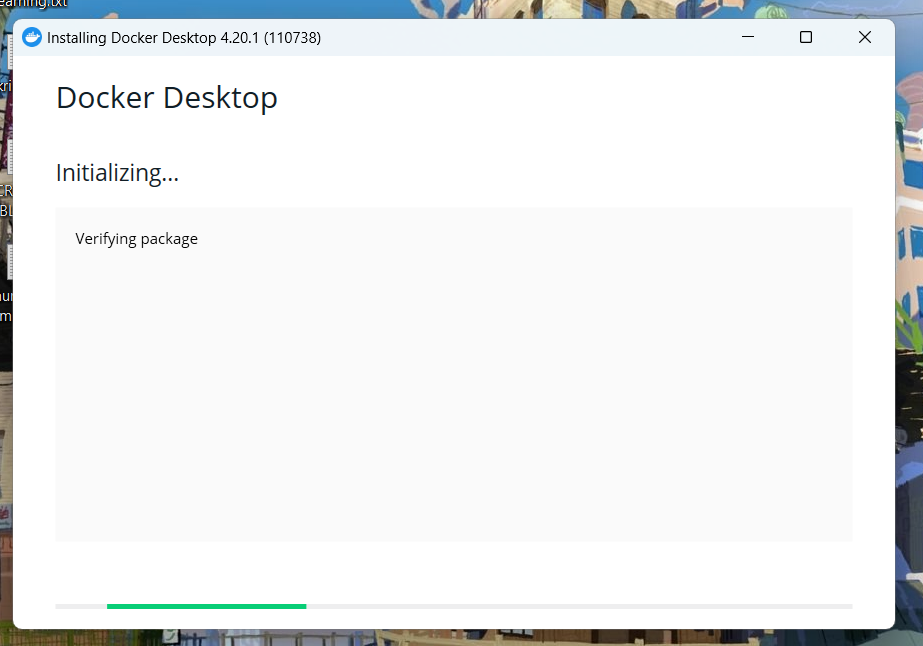
 

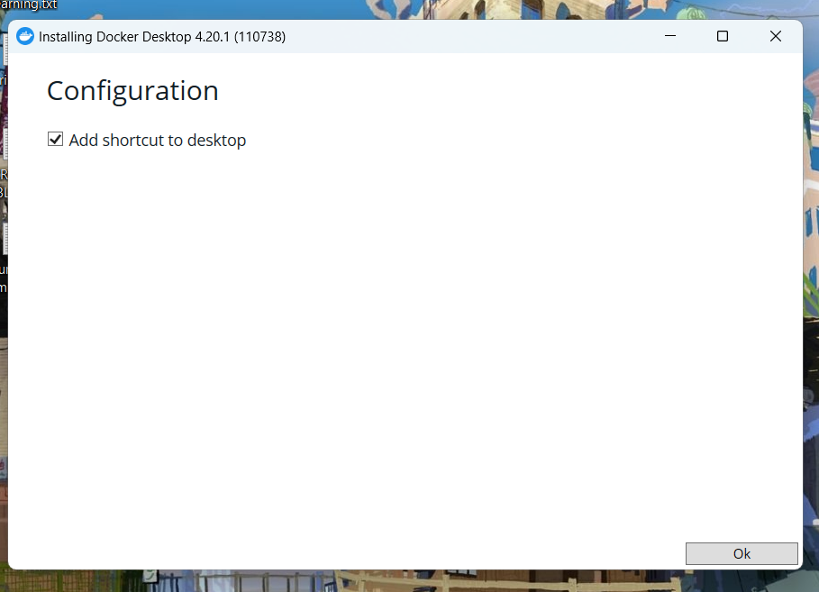
 

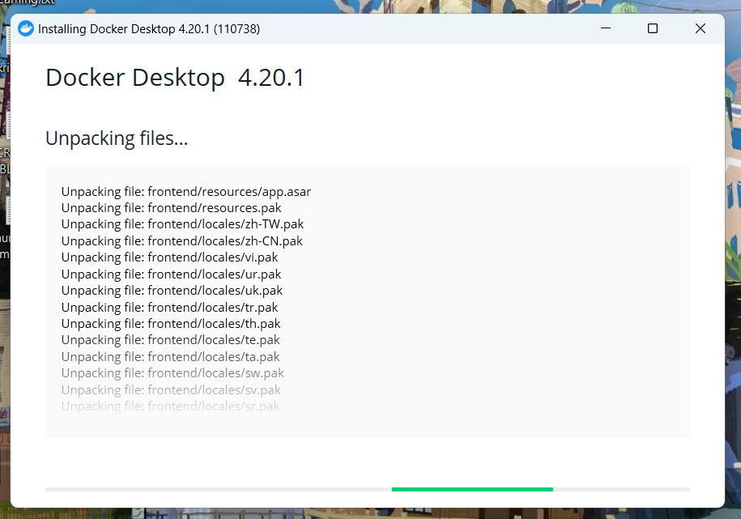
 

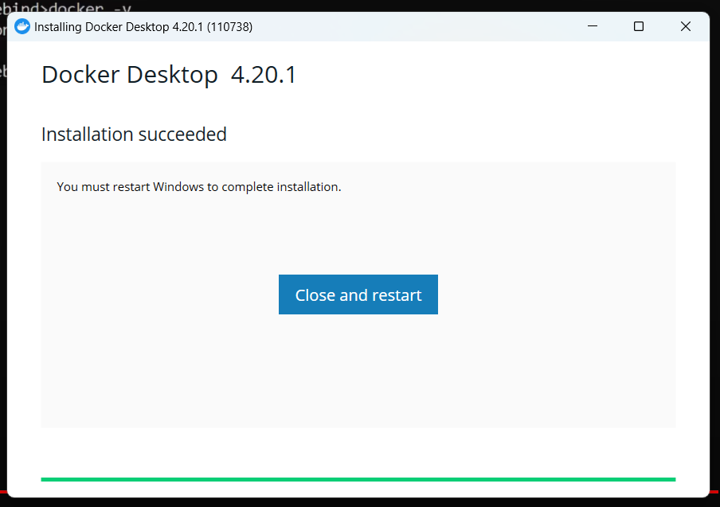
 

3. Setelah ter-install diharuskan restart agar proses instalasi selesai dengan sempurna. 

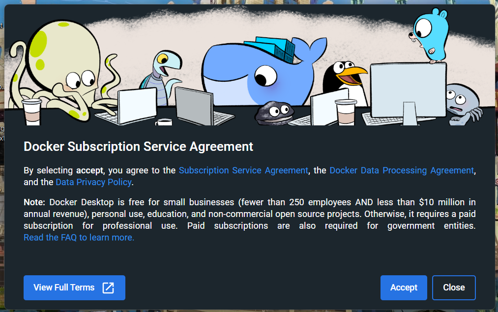
 
terdapat kendala diharuskan update wsl

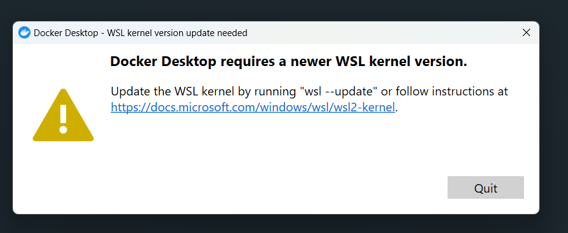
 
solusi

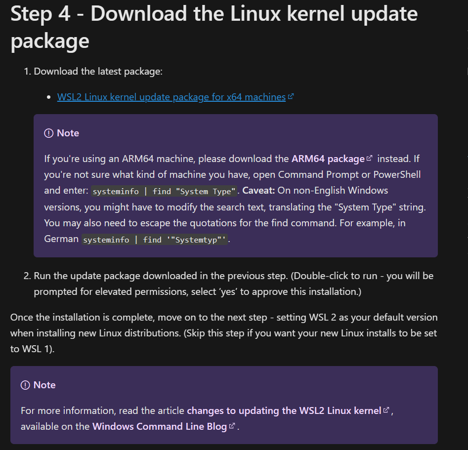
 

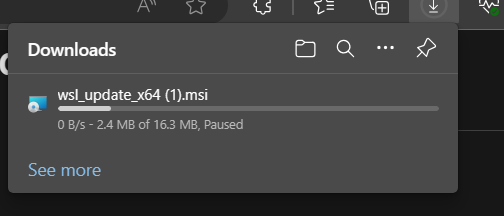
 

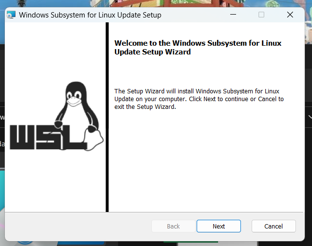
 

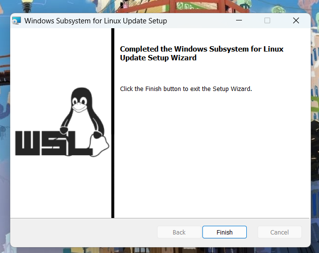
 

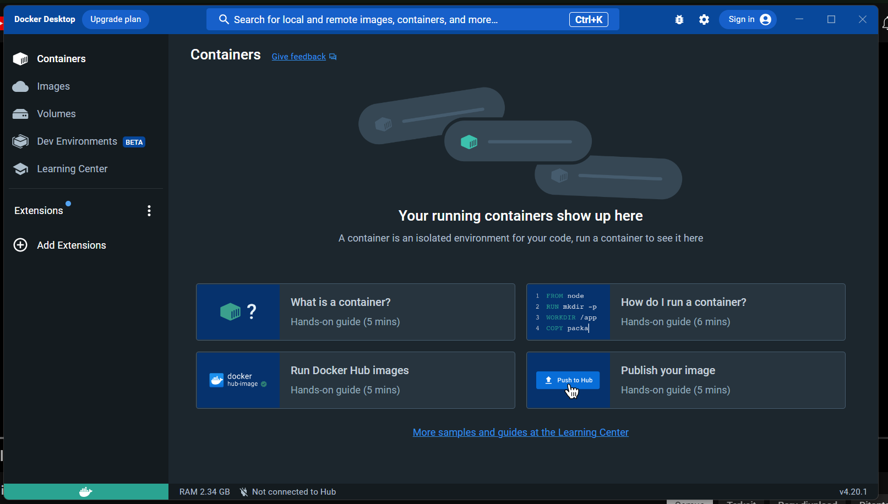
 

4. Selanjutnya [Get Started - Docker](latihan-get-started.md) 
